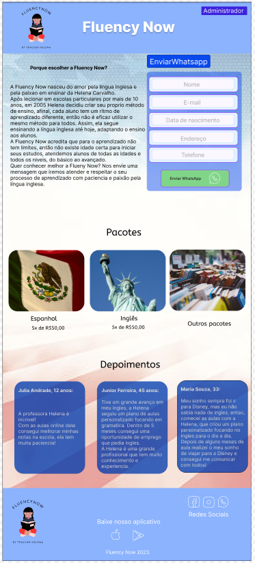
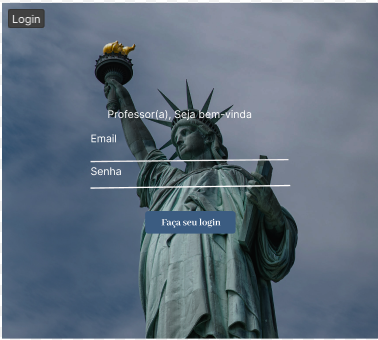
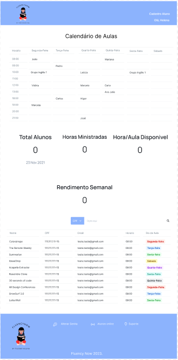
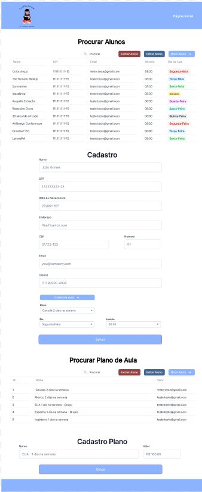

# Fluency Now

### Projeto do terceiro semestre da turma de ADS do Senac.

- Composto pelos integrantes:

- Isabela Midori

- Natalia Cerqueira

- Nicolas Marques

- Robson Vilaça

- Eduardo Feitosa

# Requisitos do Sistema

## RF01 - Entrar no portal

Permite que o professor entre no portal do administrador, utilizando login e senha

## RF02 - Verificar aulas

Permite que o professor verifique as aulas e horários agendados para a semana

## RF03 - Consultar métricas

Disponibiliza ao professor informações sobre total de alunos, horas ministradas, rendimento e horas disponíveis

## RF04 - Listar alunos

Permite que o professor visualize todos os alunos ou filtre por CPF

## RF05 - Alterar Senha

Permite que o usuário faça alteração de senha

## RF06 - Suporte

Link para o suporte do sistema

## RF07 - Cadastrar Alunos

Disponibiliza o formulário para cadastrar novos alunos

## Modelagem de banco de dados

## FIGMA

Link do projeto no figma: https://www.figma.com/file/1J5gP4EvisUBhhh80GJVwp/FluencyNow?t=3hsNA3CDhbPHmmAn-0

## Prototipação

