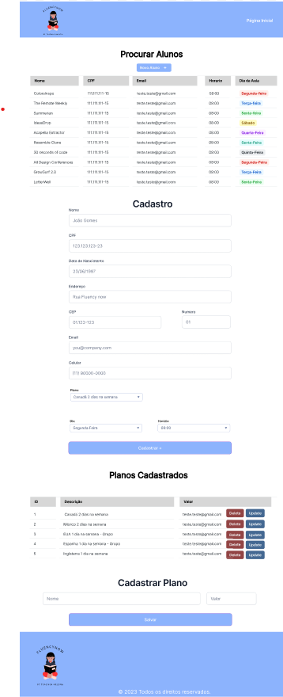
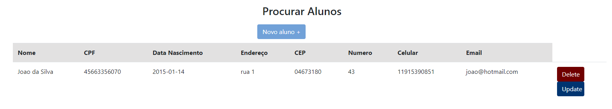
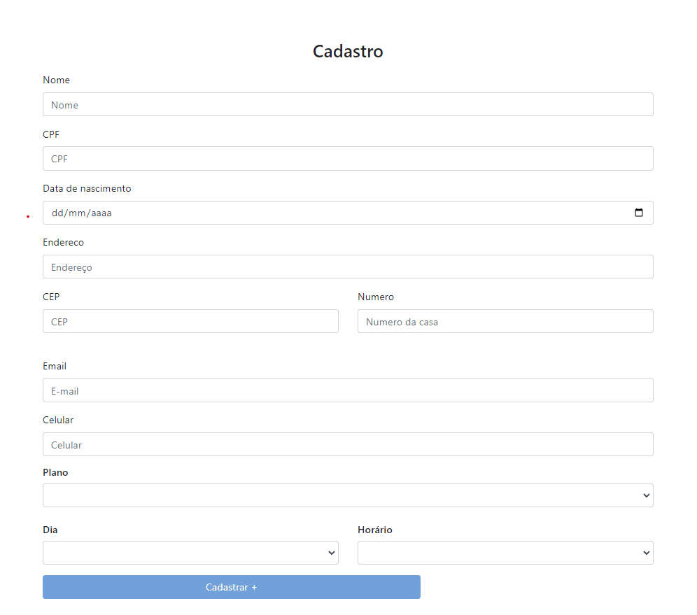
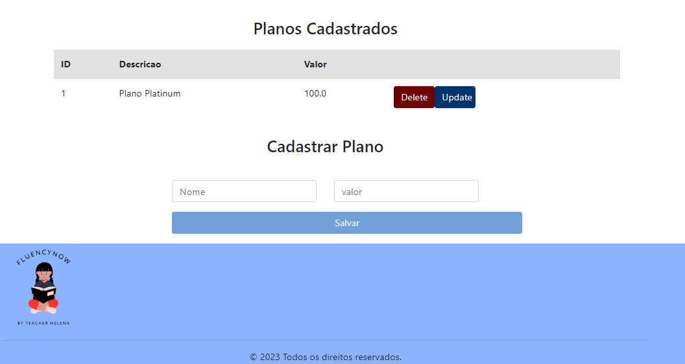

<h1 align="center"> Fluency Now </h1>

Na página de Cadastro temos algumas funcionalidades, como:

Logo no inicio da página, é apresentada uma tabela com o cadastro de todos os alunos, e com as ferramentas de Delete e Update:

Logo após é apresenatda a tela de cadastro de aluno, com um formulário para cadastro de aluno e indicação de qual plano ele vai aderir

Abaixo, temos a opção de cadastrar Planos, onde é gerado um ID para cado plano.
Havendo também a opção de Delete e Update

