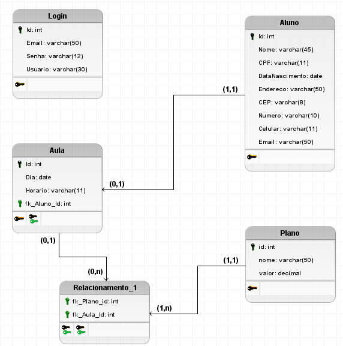

<h1 align="center"> Fluency Now </h1>

<h2 align="center">
  Acessando o console do SQL 
</h2>

## <a id="anchortext" />http://localhost:8080/fluencyNow/console/login.jsp?jsessionid=ae055d5ff17febba165570d4588c3179

 
      Acesso ao console do banco de dados pelo link 
      Driver Class:	org.h2.Driver 
    JDBC URL: jdbc:h2:~/test 
    User Name: sa 
    Passworld: sa 

<h2 align="center">
  Modelagem de banco de dados 
</h2>

