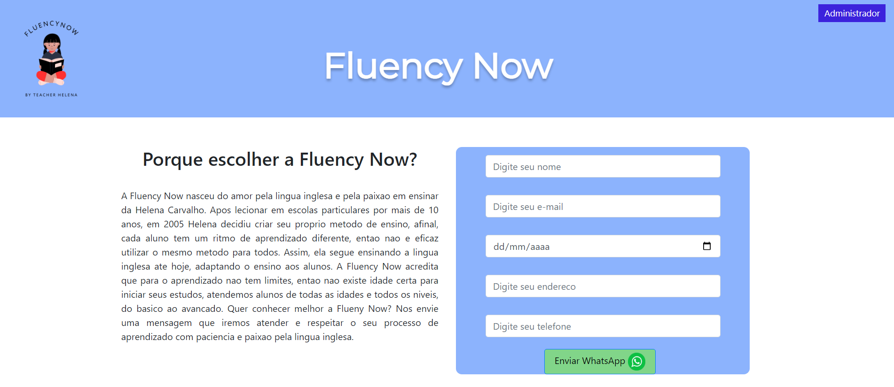
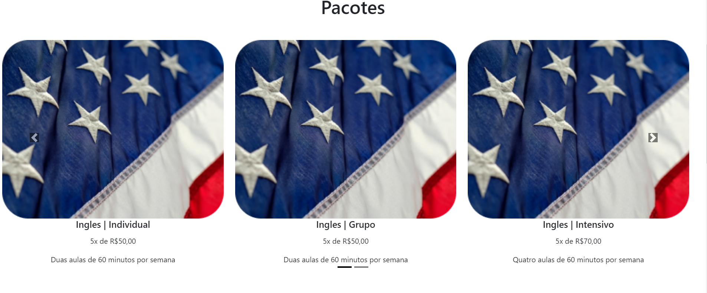
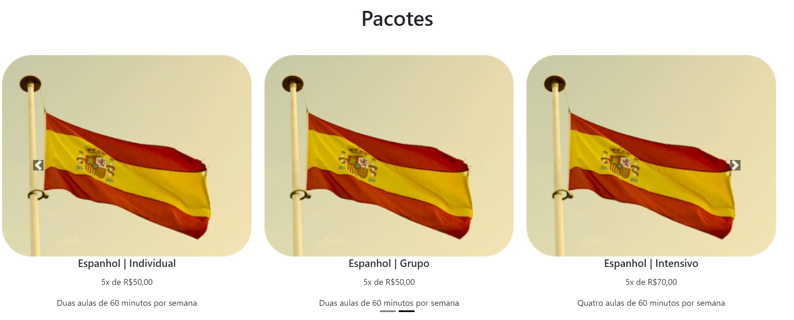

<h1 align="center"> Fluency Now </h1>

<h2 align="center">
  Acessando a nossa Home Page  
</h2>

 
      Para acessar a home page da Fluency now cole essa rota no seu browser  

## <a id="anchortext" />http://localhost:8080/fluencyNow/home

<h2 align="center">
  Conhecendo a página inicial  
</h2>

 
      No inicio da página temos o nosso header com o logo, Nome da empresa e botão de Admnistrador que no primeiro login irá direcionar para para a página de login para poder acessar a página admnistrativa após a autenticação  

## <a id="anchortext" />http://localhost:8080/fluencyNow/login

 
      Na caixa azul ao lado de "Porque escolher a Fluency Now?" temos um formulário para envio de dados do interessado ao curso à professora  

 
      No nosso carrocel temos as informalçoes dos pacotes disponiveis pela professora  

 
      Em depoimentos temos as declarações de alguns alunos que já tiveram aula com a professora Helena  

 
      Por fim temos o nosso footer onde disponibilizamos links das páginas para entrar em contato com a professora e futuramente instalação dos nossos aplicativos de estudo   

