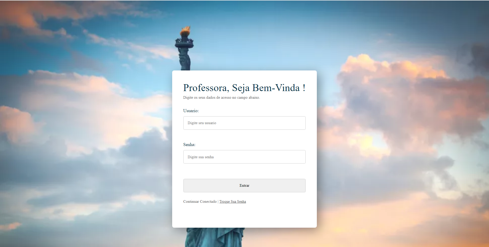

<h1 align="center"> Fluency Now </h1>

<h2 align="center">
  Acessando à página de login 
</h2>

## <a id="anchortext" />http://localhost:8080/fluencyNow/login

 
      Podemos acessar a página de login pelo botão administrador da Home Page, para acesso imediato disponibilizamos esse link 

